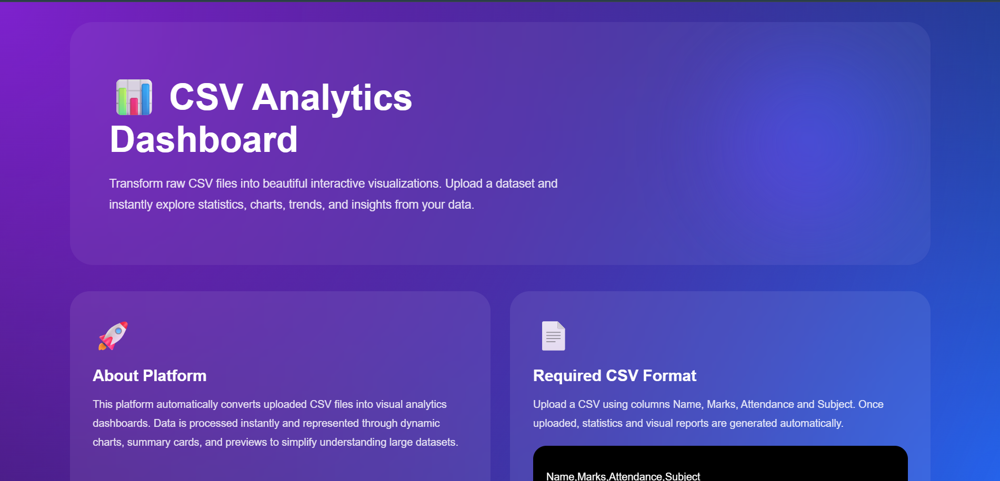
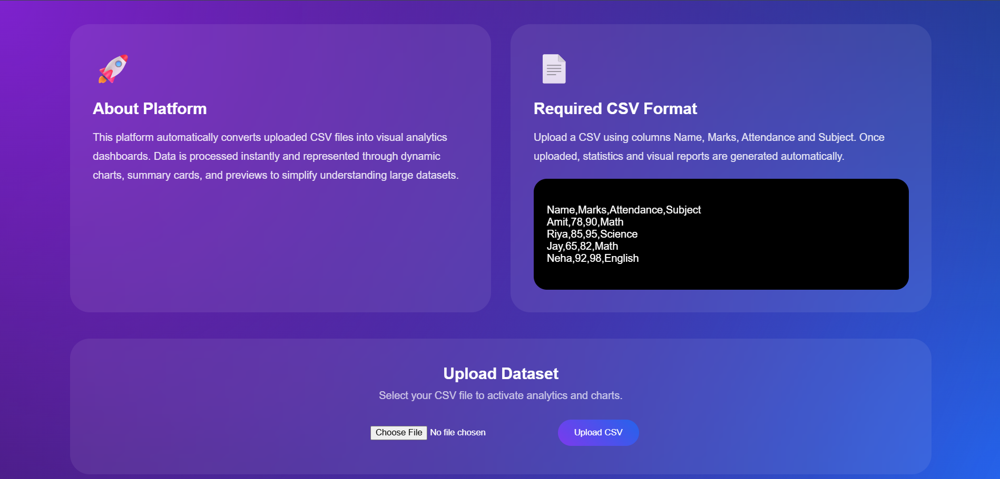
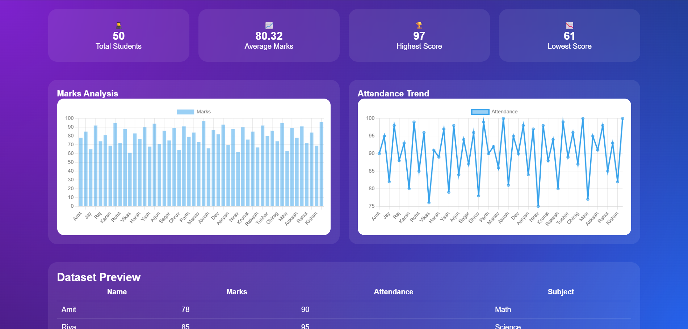

# 📊 CSV Analytics Dashboard

A modern CSV analytics platform built using FastAPI, HTML, CSS, and JavaScript that transforms uploaded datasets into interactive visualizations and meaningful insights. Users can upload CSV files and instantly explore statistics, charts, and structured data through a rich dashboard interface.

---

## 🚀 Project Overview

CSV Analytics Dashboard is designed to simplify data understanding through visual analytics. The application accepts CSV datasets, processes them through FastAPI and Pandas, and dynamically generates charts and dashboard statistics.

The platform provides an intuitive interface with a modern glassmorphism-inspired design where users can interact with uploaded datasets and explore patterns without manually analyzing raw CSV files.

---

## ✨ Features

✔ Dynamic CSV Upload System  

✔ Rich Analytics Dashboard Interface  

✔ Interactive Data Visualizations  

✔ Automatic Statistics Generation  

✔ Real-Time Dashboard Updates  

✔ Dataset Preview Table  

✔ Responsive UI Design  

✔ Empty Initial State Before Upload  

✔ Dynamic Chart Rendering  

✔ Modern Glassmorphism User Interface

---

## 🖼 Application Workflow

```text
User Uploads CSV
        ↓
FastAPI Receives Dataset
        ↓
Pandas Processes Data
        ↓
API Generates Structured Response
        ↓
Frontend Receives Data
        ↓
Dashboard Updates Automatically
        ↓
Charts + Statistics + Preview Generated
```

---

## 📁 Project Structure

```text
csv-analytics-dashboard/
│
├── backend/
│   └── app.py
│
├── frontend/
│   ├── index.html
│   ├── style.css
│   └── script.js
│
├── data/
│
├── requirements.txt
│
└── README.md
```

---

## ⚙ Technology Stack

### Backend

- FastAPI
- Pandas
- Uvicorn
- Python Multipart

### Frontend

- HTML5
- CSS3
- JavaScript

### Visualization

- Chart.js

### Design

- Glassmorphism UI
- Responsive Dashboard Layout

---

## 📄 Required CSV Format

The dashboard expects datasets following this structure:

```csv
Name,Marks,Attendance,Subject
Amit,78,90,Math
Riya,85,95,Science
Jay,65,82,Math
Neha,92,98,English
```

Expected fields:

| Column | Description |
|----------|-------------|
| Name | Student Name |
| Marks | Student Score |
| Attendance | Attendance Percentage |
| Subject | Subject Category |

Once uploaded, the dashboard automatically processes these fields and generates visual analytics.

---

## 📈 Dashboard Components

### Statistics Cards

The dashboard automatically generates key metrics:

- Total Students
- Average Marks
- Highest Score
- Lowest Score

### Interactive Charts

Visualization components include:

- Marks Analysis Bar Chart
- Attendance Trend Line Chart

### Dataset Preview

Displays uploaded dataset records directly inside the dashboard.

---

## 📸 Dashboard Preview

### Home Page

<p align="center">
  
</p>

---

### About Section

<p align="center">
  
</p>

---

### Dashboard Analytics

<p align="center">
  
</p>

---

### Dataset Preview

<p align="center">
  
</p>

## ⚙ Installation Guide

Clone repository:

```bash
git clone YOUR_REPOSITORY_LINK
```

Move into project:

```bash
cd csv-analytics-dashboard
```

Install dependencies:

```bash
pip install -r requirements.txt
```

Or install manually:

```bash
pip install fastapi
pip install uvicorn
pip install pandas
pip install python-multipart
```

---

## ▶ Run Backend Server

Move into backend:

```bash
cd backend
```

Run FastAPI:

```bash
uvicorn app:app --reload
```

Backend starts:

```text
http://127.0.0.1:8000
```

API endpoint:

```text
http://127.0.0.1:8000/data
```

---

## ▶ Run Frontend

Open another terminal:

```bash
cd frontend
python -m http.server 5500
```

Open browser:

```text
http://localhost:5500
```

---

## 🔄 User Flow

Step 1: Open Dashboard  

Step 2: Upload CSV Dataset  

Step 3: FastAPI Receives File  

Step 4: Dataset Processed Using Pandas  

Step 5: API Returns Structured Data  

Step 6: Dashboard Updates Automatically  

Step 7: Charts and Statistics Generated  

Step 8: Dataset Preview Rendered

---

## 🧪 Website Testing

The CSV Analytics Dashboard was validated using TestGrid to verify overall website functionality and user interaction flow.

Testing focused on validating:

✔ CSV upload workflow  

✔ Dashboard rendering  

✔ Chart generation  

✔ API communication  

✔ Dynamic updates after upload  

✔ Dataset preview functionality  

✔ User interaction flow  

Testing Platform:

[TestGrid](https://testgrid.io/)

This validation process helped ensure that the complete dashboard workflow operates smoothly from dataset upload through visualization generation.
